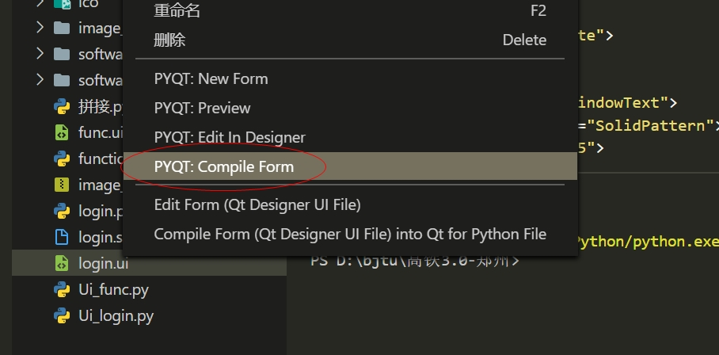

# Pyqt5_highspeed
综述：利用python的pyqt库实现一个简洁的pyqt5界面

## 界面介绍
在login.ui 和 function.ui中是用pyqt5自带的图形化界面拖动控件生成的基础界面，其中控件的布局等需要自行设计和微调，具体方法参见网络

## 代码介绍

1. 从.ui文件转为.py文件

利用python自带的工具包，在vscode中可以直接右键生成对应.py文件，其实文件生成后随着.ui文件的改动并不实时，所以并不长久，但是仅仅为了实现功能，考虑不足的地方请见谅

2. 修改python文件

